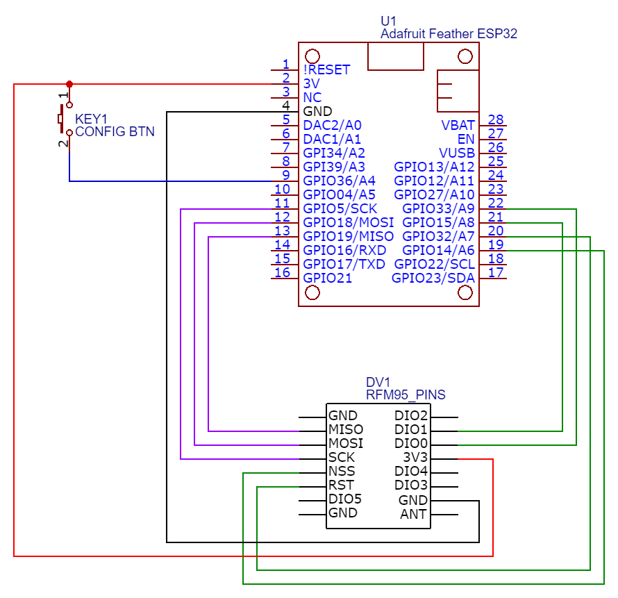

# ESP32LoRaMqttPaxCounter


Counts the number of active BLE devices (smartphones).
* LoRa or WiFi + MQTT as connectivity options
* Configuration via webserver on the MCU


## Hardware

[Adafruit Feather ESP32](https://www.adafruit.com/product/3405) or another ESP32 DevKit

If LoRa is used, a `RFM95W` LoRa Module e.g. [Radio FeatherWing](https://www.adafruit.com/product/3231)

### Wiring



## Setup

### Precompiled sketch

*Requires Python and pip*

1. Clone the repo
    ```sh
    git clone https://github.com/WullT/ESP32LoRaMqttPaxCounter.git
    ```
2. On Windows
      - Run [upload.bat](Compiled/upload.bat) and plugin the ESP32 as soon as you are asked to 
   
    On other OS
    - Install [esptool](https://pypi.org/project/esptool/)
        ```sh
        pip install esptool
        ```
    - Run the Python Script [upload_to_node.py](Compiled/upload_to_node.py)
        ```sh
        # go to the Compiled/ directory
        cd ~/ESP32LoRaMqttPaxCounter/Compiled
        # run the uploader script
        python upload_to_node.py
        ```
    - Plug in the ESP32 as soon as you are asked to

- To enable serial output (for debug purpose), run:
    ```sh
    # go to the Compiled/ directory
    cd ~/ESP32LoRaMqttPaxCounter/Compiled
    python upload_to_node.py -d
    ```


### Using Arduino IDE

Set the Partition Scheme to `No OTA (Large APP)`

Following Libraries have to be installed:
* [CRC32](https://github.com/bakercp/CRC32)
* [PubSubClient](https://github.com/knolleary/pubsubclient)
* [AsyncTCP](https://github.com/me-no-dev/AsyncTCP)
* [ESPAsyncWebServer](https://github.com/me-no-dev/ESPAsyncWebServer)
* [LMIC](https://github.com/mcci-catena/arduino-lmic)


## Configuration
